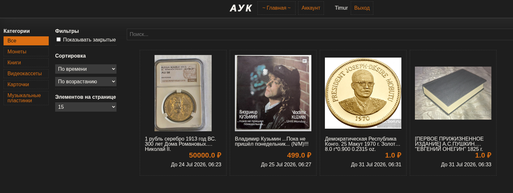
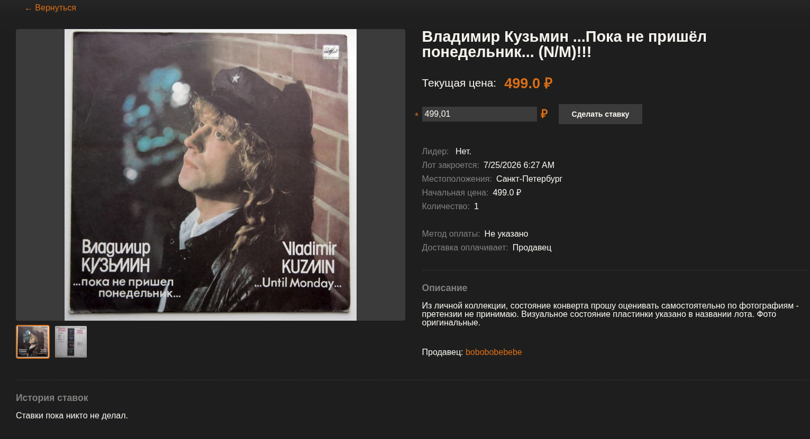
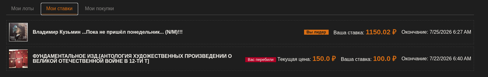

# Auk

Auk -- это веб-платформа для проведения аукционов. Приложение позволяет
создавать создавать лоты, торговаться, делая ставки, и оформлять выкупы
товаров.

# Скриншоты

## Домашняя страница


## Страница лота


## Ставки пользователя


# Технологии

- [ASP.NET Core](https://dotnet.microsoft.com/en-us/apps/aspnet) - основной фреймворк для API
- [Entity Framework Core](https://learn.microsoft.com/en-us/ef/core/get-started/overview/first-app?tabs=netcore-cli) - ORM для работы с базой данных
- [JWT](https://www.jwt.io/introduction#what-is-json-web-token) - аутентификация пользователей
- [Docker](https://docs.docker.com/get-started/) - контейнеризация приложения
- [Docker Compose](https://docs.docker.com/compose/) - оркестрация контейнеров (сервер, бд)
- [HTMX](https://htmx.org/) - библиотека для построения пользовательского интерфейса

# Инструкция по запуску

## Предварительные требования
- Установите и настройте [.NET SDK 10](https://dotnet.microsoft.com/en-us/download/dotnet/10.0)
- Установите и настройте [Docker](https://docs.docker.com/get-started/) и [Docker Compose](https://docs.docker.com/compose/)

## Шаги запуска
Клонируйте репозиторий:
```bash
git clone https://github.com/Timur1232/auk.git
```

Настройте файл конфигурации бэкенда:
```bash
vim appsettings.Production.json
```

Обновите следующие параметры:
- `ConnectionStrings.db_conn` - строка подключения к вашей БД
- `JwtSettings.Secret` - секретный ключ для JWT

Запустите приложение с помощью Docker Compose:
```bash
docker compose up -d --build
```

Приложение будет доступно по адресу: http://localhost:8080

# Функциональные возможности

- Регистрация и аутентификация пользователей
- Создание и управление лотами
- Загрузка фотографий
- Просмотр лотов
- Размещение ставок
- Выкуп выигранных лотов

Баймурадов Тимур
